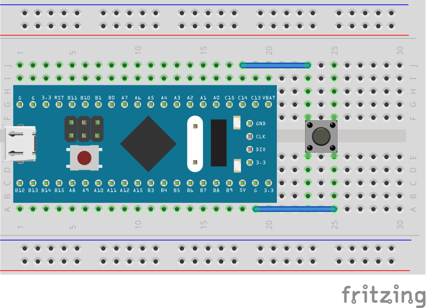

# Overview

This is a minimal project which uses some device header files provided by ST to give us access to convenient aliases for peripheral registers.

The example project initializes pin C14 as input with a built-in pull-up resistor; it listens for button presses on a button connected to ground. pin C13 is set to push-pull output, and it is connected to a built-in LED on ST's "Blue pill" board. 



# Uploading and Debugging

A Makefile is provided, and I've tested the program with a 'Blue pill' board using the STM32F103C6T8 chip. To upload the resulting program, you can use your choice of uploader. I use Texane's "stlink" project:

https://github.com/texane/stlink

It's a fairly simple process to upload:

1. Plug your board in via ST-LINK

2. Uplodad firmware
```bash
make flash
```

Once the code is uploaded, you can more or less treat the GDB debugging session like you would any other C/C++ program. You can set breakpoints, step through the code with `s`/`si`/`n`/`ni`/etc, inspect variables or memory addresses, and so on.
